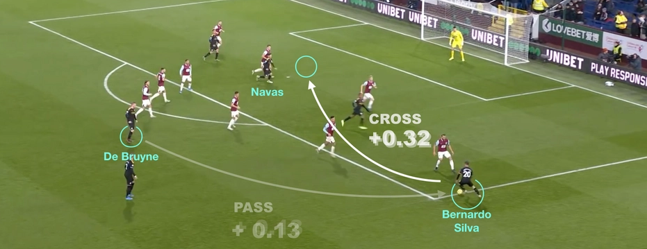
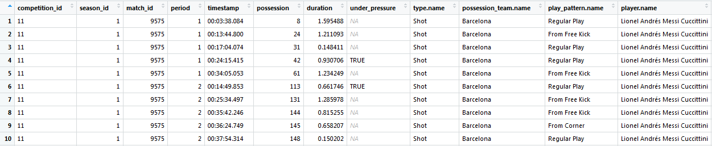
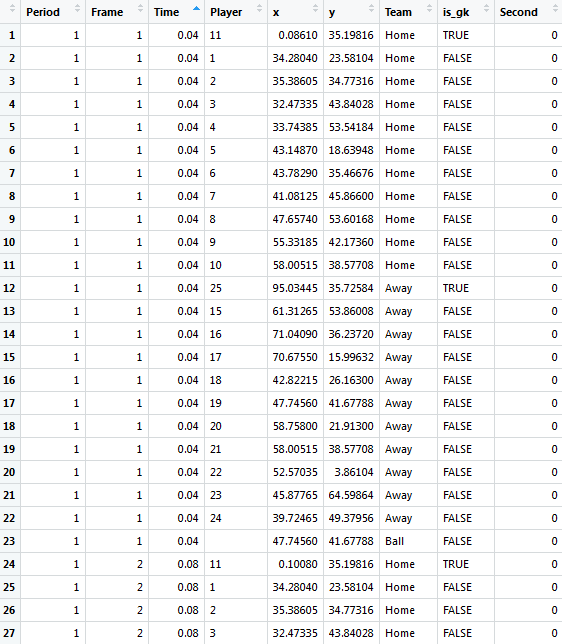
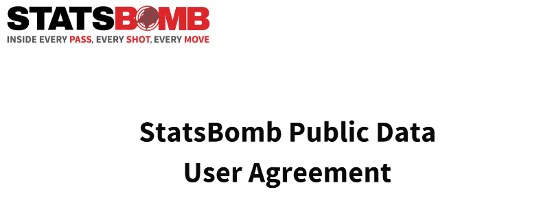
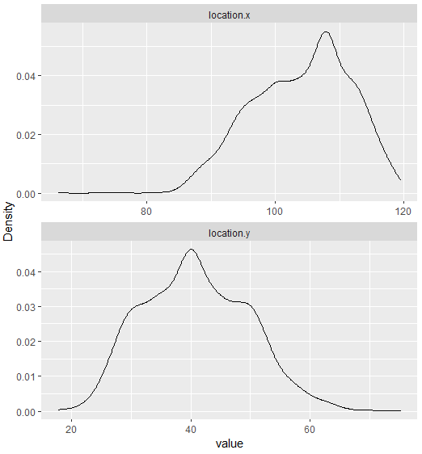
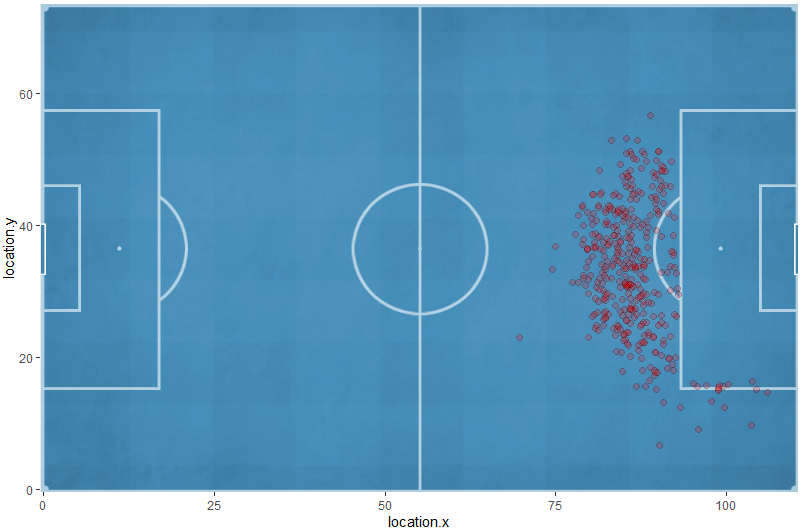
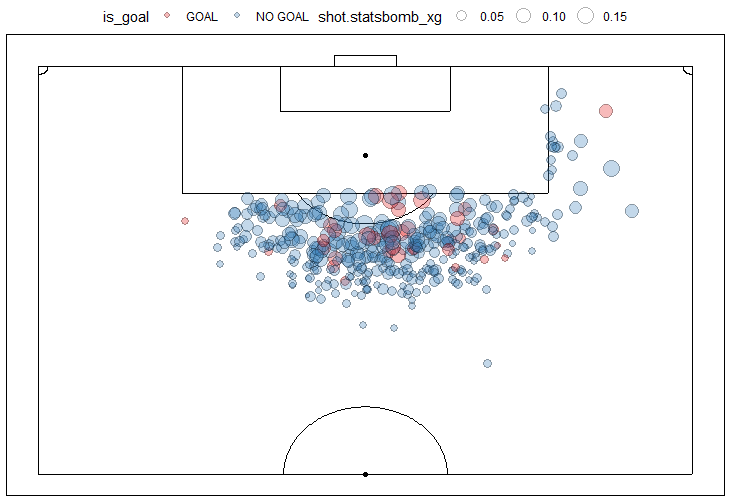

--- 
title       : R para visualizar datos deportivos espaciales
#subtitle    : 
author      : Ismael Gómez Schmidt
job         : Data Scientist 49ing.ch / Co-Founder futbolytics.cl / Frontman datofutbol.cl
framework   : io2012
highlighter : highlight.js  # {highlight.js, prettify, highlight}
hitheme     : tomorrow      # 
#widgets     : []            # {mathjax, quiz, bootstrap}
logo        : png_icons/field.png
biglogo     : fondo.jpg
mode        : selfcontained # {selfcontained, standalone, draft}
knit        : slidify::knit2slides
--- 

<style>
.title-slide {
  background-color: white; 
}

.title-slide hgroup > h1{
 font-family: 'Open Sans Condensed', sans-serif;
 color: gray;
 font-size:52px;
}

.title-slide hgroup > h2 {
  font-family: 'Open Sans Condensed', sans-serif;
  color: #3182bd;
}

.title-slide hgroup > p {
  color: black;
}

strong {
  font-weight: bold;
}

code.r{
  font-size: 12px;
}


</style>


## Agenda
> - **Analítica deportiva**:<br/ >
    - Definición<br/ >
    - Contexto histórico-tecnológico<br/ >
    - Áreas de aplicación
<br/ >
<br/ >
> - **Datos deportivos espaciales**:<br/ >
        - Alcance<br/ >
        - Tipos de datos
<br/ >
<br/ >
> - **Flujo de trabajo y herramientas**:<br/ >
        - Pasos a seguir<br/ >
        - RStudio + paquetes
<br/ >
<br/ >
> - **Ejemplos**
 

--- .segue bg:#0C7BB9
## Analítica deportiva

--- bg: white
## Analítica deportiva
<center></center>
<br/ >
> - **Definición general de analítica**: La aplicación de métodos estadísticos y/o matemáticos a un conjunto de datos, principalmente mediante herramientas informáticas, de manera tal que se recoja información útil que permita obtener ventajas competitivas, optimizar un proceso, reducir un margen de error, entre otros.
<br/ >
<br/ >
> - La Analítica deportiva es aplicar lo anterior en algún deporte!

--- &twocol w1:50% w2:50% bg:black 
## Contexto histórico-tecnológico

*** =left
<center></center>
<br/ >
<center></center>


*** =right
<center></center>
<br/ >
<center></center>

--- bg:black
## Contexto histórico-tecnológico
<center></center>

--- bg:black
## Áreas de aplicación
<center></center>


--- .segue bg:#0C7BB9
## Datos deportivos espaciales

--- bg: white
## Alcance del webinar

> - Datos de Fútbol
<br/ >
> - Eventos: tiros libres
<br/ >
> - Aplicable a todos los deportes que se juegan dentro de una cancha, otros tipos de eventos y a data de tracking:<br/ >
<center></center>

--- bg: white
## Tipos de datos

### 1) Datos de eventos: estructura y contenido

> - Registro de distintos eventos relevantes con sus detalles respectivos<center></center></a>

> - <center></center>

--- 
## Datos de eventos: estructura y contenido

<center></center>

[Fuente](https://www.nature.com/articles/s41597-019-0247-7)


--- &twocol w1:50% w2:50%
## Datos de eventos: Proveedores

*** =left
<br/ >
<br/ >
<center></center>
<br/ >
<br/ >
<br/ >
<center></center>

*** =right
<center></center>
<br/ >
<br/ >
<center></center>

--- bg: white
## Datos de tracking: estructura y contenido

Registro de **coordenadas para los 22 jugadores y el balón**<center></center>

--- &twocol w1:50% w2:50%
## Datos de tracking: Proveedores

*** =left
<br/ >
<br/ >
<center></center>
<br/ >
<br/ >
<br/ >
<br/ >
<center></center>

*** =right
<br/ >
<br/ >
<center></center>
<br/ >
<br/ >
<br/ >
<br/ >
<center></center>


--- .segue bg:#0C7BB9
## Flujo de trabajo y herramientas

--- bg: white 
## Flujo de trabajo: Pasos a seguir (0-2)
<br/ >
> - **Paso 0: Preguntas**<br/ >
¿Qué voy a visualizar?, ¿Por qué?, ¿Para qué?
<br/ >
<br/ >
> - **Paso 1: Obtener datos**<br/ >
Tipo de datos, proveedores, formatos, disponibilidad, ¿Están actualizados?, ¿Son precisos?, acuerdo de uso
<br/ >
<br/ >
> - **Paso 2: Procesar y explorar datos**<br/ >
Adecuar estructura, limpiar, convertir (ej: coordenadas)<br/ >
Conocer atributos, distribuciones, categorías, detalles específicos, etc.
<br/ >
<br/ >
> - **Revisitamos el paso 0**: ¿Los datos que tengo me sirven para lo que busco?
<br/ >
<br/ >

--- bg: white
## Flujo de trabajo: Pasos a seguir (3-5)
<br/ >
> - **Paso 3: Visualización de cancha**<br/ >
Distintos enfoques: a) imagen de fondo (PNG, JPG) o b) "dibujar" en R
<br/ >
<br/ >
> - **Paso 4: Mapeo de datos**<br/ >
geom, color, fill, size, label, alpha + <br/ >paletas de colores, rangos de tamaños
<br/ >
<br/ >
> - **Revisitamos el paso 0**: ¿El resultado responde a mi(s) pregunta(s) inicial(es)? Acotamos el alcance. Volvemos a pasos previos.
<br/ >
<br/ >
> - **Paso 5: Detalles finales**<br/ >
Facetas, leyenda, títulos, anotaciones + <br/ >difusión (formato de exportación, plataforma comunicación, código para reproducibilidad)

--- bg: white
## Herramientas: RStudio + paquetes
<center></center>


--- .segue bg:#0C7BB9
## Ejemplos 

--- bg: white
## Ejemplo 1
> - **Paso 0**: "Ubicación de los tiros de Messi"
<br/ >
> - **Paso 1**: Datos abiertos de **Statsbomb**:<br/ >
[- Github](https://github.com/statsbomb/open-data)<br/ >
[- Sitio web (detalles + user agreement)](https://www.statsbomb.com/resource-centre)<br/ ><br/ ><center></center>

--- &twocolB
## Paquete [{**StatsBombR**}](https://github.com/statsbomb/StatsBombR)

*** =left

```r
devtools::install_github("statsbomb/StatsBombR")
library(StatsBombR)

competitions <- FreeCompetitions() 
liga_spain <- competitions %>% filter(competition_id == 11)
range(liga_spain$season_name)

games <- FreeMatches(liga_spain)
glimpse(games)
unique(paste0(games$home_team.home_team_name, "-", 
              games$away_team.away_team_name))
barcelona_games <- games %>% 
                   filter("Barcelona" %in% c(home_team.home_team_name, 
                                             away_team.away_team_name))

barcelona_events <- StatsBombFreeEvents(MatchesDF = barcelona_games)
library(readr)
#write_rds(barcelona_events, "barcelona_events.rds")
#barcelona_events <- read_rds("barcelona_events.rds")
messi_events <- barcelona_events %>% 
                filter(str_detect(player.name, "Messi"))

glimpse(messi_events)
table(messi_events$type.name)

messi_shots <- messi_events %>% 
               filter(type.name == "Shot")

messi_shots_cleaned <- allclean(messi_shots)
```

*** =right
> - <center></center>
<br/ >
> - <center></center>


--- &twocolC
## Paso 2: Exploración

*** =left

```r
data <- messi_shots_cleaned %>% 
        left_join(liga_spain %>% select(season_id, season_name)) %>%
        select(match_id, period, timestamp, type.name, possession_team.name, play_pattern.name,
               player.name, position.name, shot.type.name, location.x, location.y,
               shot.body_part.name, shot.technique.name, shot.statsbomb_xg, 
               shot.outcome.name, shot.end_location.x, shot.end_location.y, season_name)

devtools::install_github("boxuancui/DataExplorer")
library(DataExplorer)
plot_bar(data %>% select(shot.type.name, shot.outcome.name), ncol = 2)
plot_density(data %>% select(location.x, location.y), ncol = 1)
```

> - <center></center>


*** =right
Paquetes: {dplyr}{tidyr}{lubridate}{forcats}{ggplot2}{[**DataExplorer**](http://boxuancui.github.io/DataExplorer/)}
<br/ >
> - <center></center>


--- &twocolB
## Paso 2: Procesar 

*** =left
Coordenadas según proveedor<br/ ><center></center>

*** =right


```r
data <- data %>%
        mutate_at(vars(contains('.x')), funs( . / 120 * 110)) %>% 
        mutate_at(vars(contains('.y')), funs( (80 - .) / 80 * 73))

data_free_kick <- data %>%
        filter(shot.type.name == "Free Kick")
```

> - **Sugerencias**:<br/ >
- Invertir coordenadas Y
- Transformar de yardas a metros: queda en 110x73 [m]. Otra opción es cancha estándar promedio 105x68 [m]
- No hay que invertir las coordenadas X según Period (siempre considera la misma dirección de ataque)
- Trabajar con grupos de tiros separados según "type.name"


--- &twocolB
## Paso 3: A) Cancha como imagen de fondo

*** =left

```r
library(jpeg)
img <- jpeg::readJPEG("image_path")

library(grid)
p <- rasterGrob(img, width = unit(1, "npc"), height = unit(1, "npc"))

library(ggplot2)
g <- ggplot() +
        annotation_custom(p, xmin = -0.5, xmax = 110.5, 
                             ymin = -0.5, ymax = 73.5) +
        scale_x_continuous(limits = c(-0.5, 110.5), expand = c(0,0)) +
        scale_y_continuous(limits = c(-0.5, 73.5), expand = c(0,0))
        
g + geom_point(data = data_free_kick, 
               mapping = aes(x = location.x, y = location.y), 
               pch = 21, alpha = 0.2, fill = "red", size = 2)
```


```r
library(png)
img2 <- png::readPNG("image2_path")
p2 <- rasterGrob(img2, width = unit(1, "npc"), height = unit(1, "npc"))
g2 <- ggplot() +
      annotation_custom(p2, xmin = - Inf, xmax = Inf, ymin = - Inf, ymax = Inf) +
      scale_x_continuous(limits = c(-15, 15), expand = c(0,0)) +
      scale_y_continuous(limits = c(7, 30.2), expand = c(0,0))
g2
```

*** =right

<center></center>

<center></center>

--- &twocolB
## Paso 3: B) Dibujar la cancha con ggplot2 y ggforce

*** =left

```r
library(ggforce)
# función para dibujar la mitad ofensiva de la cancha invertida
get_pitch <- function(gp, pitch_fill = "white", pitch_col = "lightgrey"){
        contorno_df <- data.frame(x = c(55, 55, 110, 110), 
                                  xend = c(55, 110, 110, 55),
                                  y = c(0, 73, 73, 0),
                                  yend = c(73, 73, 0, 0))
        
        areas_df <- data.frame(x = c(110, 93, 93, 110, 104, 104), 
                               xend = c(93, 93, 110, 104, 104, 110), 
                               y = c(16, 16, 57, 27, 27, 46),
                               yend = c(16, 57, 57, 27, 46, 46))
        gp +
                theme_void() +
                theme(panel.background = element_rect(fill = pitch_fill),
                      plot.margin = unit(c(0.3, 0.3, 0.3, 0.3), "cm")) +
                # rectángulos
                geom_segment(data = contorno_df,
                             aes(x = x, xend = xend, y = y, yend = yend), 
                             col = pitch_col) +
                geom_segment(data = areas_df,
                             aes(x = x, xend = xend, y = y, yend = yend), 
                             col = pitch_col) +
                geom_rect(aes(xmin = 110, xmax = 111.5, ymin = 33, ymax = 40), 
                          fill = "transparent", col = pitch_col) +
                # puntos
                geom_point(aes(x = 110/2, y = 73/2), col = pitch_col) +
                geom_point(aes(x = 98, y = 73/2), col = pitch_col) +
                # semi círculos
                geom_arc(aes(x0 = 98, y0 = 73/2, r = 9.15, start = -34*pi/180, 
                             end = -146*pi/180), col = pitch_col) + #sigue...
}
```

*** =right

```r
                geom_arc(aes(x0 = 110/2, y0 = 73/2, r = 9.15, start = 0, 
                             end = 180*pi/180), col = pitch_col) +
                geom_arc(aes(x0 = 110, y0 = 73, r = 1, start = 270*pi/180, 
                             end = 360*pi/180), col = pitch_col) +
                geom_arc(aes(x0 = 110, y0 = 0, r = 1, start = 180*pi/180, 
                             end = 270*pi/180), col = pitch_col) +
                coord_flip() +
                scale_y_reverse()
}
get_pitch(gp = ggplot(), 
          pitch_fill = "white", pitch_col = "black") +
geom_point(data = data_free_kick, 
           mapping = aes(x = location.x, y = location.y), 
           alpha = 0.3, col = "darkblue", size = 2)
```

<center></center>

--- bg: white
## Paso 4: Mapeo de datos

> - **geom**: tiros -> geom_point(); pases -> geom_segment(); mapas de calor -> density_2d()
<br/ ><br/ >
> - **color** y/o **fill**: resultado del tiro -> categórico; valor xG -> secuencial
<br/ ><br/ >
> - **size**: valor xG
<br/ ><br/ >
> - Usar **alpha** para resolver en parte el overlapping
<br/ ><br/ >
> - **label** o **text** para anotaciones
<br/ ><br/ >
> - Ajustar [paletas de colores](https://colorbrewer2.org/) y rangos de tamaños según que se decidió y los resultados

--- bg: white
## Output temporal

```r
data_free_kick <- data_free_kick %>%
        mutate(is_goal = ifelse(shot.outcome.name == "Goal", "GOAL", "NO GOAL"))
get_pitch(gp = ggplot(data_free_kick), pitch_fill = "white", pitch_col = "black") + 
        geom_point(mapping = aes(x = location.x, y = location.y, size = shot.statsbomb_xg, fill = is_goal), pch = 21, alpha = 0.3, col = "black", stroke = 1.05) +
        scale_fill_brewer(palette = "Set1") +
        theme(legend.position = "top")
```
<center></center>


--- bg: white
## Paso 5: Detalles finales


```r
n_games <- data %>% distinct(match_id) %>% nrow()
messi_stats <- data_free_kick %>%
            summarise(Games = n_games, Shots = n(), xG_Sum = round(sum(shot.statsbomb_xg), 2),
                      Goals = sum(ifelse(is_goal == "GOAL", 1, 0)),
                      xG_dif = paste(ifelse(Goals > xG_Sum, "+", ""), round(Goals - xG_Sum, 2)),
                      xG_per_shot = round(xG_Sum / Shots, 2), Shots_per_goal = round(Shots/Goals, 2)) %>% 
            t() %>% as.data.frame()
library(gridExtra)
tt <- ttheme_minimal(base_size = 8, core = list(bg_params = list(fill = NA, col = NA), 
                                                fg_params = list(fontface = 3L, col = "white")),
                     rowhead = list(fg_params = list(col = "white", fontface = 3L)))
library(ggtext)
g <-  ggplot(data_free_kick) + 
        geom_density2d_filled(mapping = aes(x = location.x, y = location.y, fill = ..level..),
                               contour_var = "ndensity", breaks = seq(0.1, 1.0, length.out = 10)) +
        scale_fill_brewer(palette = "YlOrRd", direction = -1) +
        geom_point(data = data_free_kick %>% filter(shot.outcome.name == "Goal"),
                   mapping = aes(x = location.x, y = location.y, size = shot.statsbomb_xg), fill = "blue",
                   pch = 21, alpha = 0.5, col = "white", stroke = 1)
get_pitch(gp = g, pitch_fill = "black") +
        guides(fill = "none", size = guide_legend(title = "xG")) +
        theme(legend.position = "top",
              plot.title = element_text(size = 16, hjust = 0.5),
              plot.subtitle = element_markdown(size = 12, hjust = 0.5)) +
        annotation_custom(tableGrob(messi_stats, cols = NULL, theme = tt,
                                    rows = c("Partidos", "Tiros libres", "suma xG", "Goles", 
                                             "xG dif.", "xG por shot", "Tiros por gol")), 
                                    xmin = 65, xmax = 70, ymin = -8, ymax = -8) +
        labs(title = "Tiros libres de Messi en La Liga 2006/2007 - 2019/2020",
             subtitle = "Mapa de calor indica densidad de tiros. Puntos indican <span style='color:blue'>**Goles**</span>.<br/ >",
             caption = "Autor: @DatoFutbol_cl | Data: Statsbomb")
```

--- bg: white
<center></center>


--- &twocolD
## Ejemplo 2): Datos de tracking

*** =left
<center></center>

*** =right
<center></center><br/ ><center></center>


```r
library(remotes)
install_github("Dato-Futbol/soccerAnimate")
```

> - [Repositorio con tutorial](https://github.com/Dato-Futbol/soccerAnimate)

--- {
tpl: thankyou, 
social: [{title: Futbolytics, href: "https://futbolytics.cl"}, {title: Twitter Dato Fútbol, href: "https://twitter.com/DatoFutbol_cl"}, {title: Blog Dato Fútbol, href: "https://datofutbol.cl"}]
}

## Gracias!

