

## Agenda
<br/ >
<br/ >
>- Analítica deportiva
<br/ >
<br/ >
>- Datos y herramientas
<br/ >
<br/ >
>- Ejemplos de uso de datos en **fútbol** y **hockey sobre hielo**
<br/ >
<br/ >
 

--- .segue bg:#0C7BB9
## Analítica deportiva

--- &twocol w1:50% w2:50% bg:black

*** =left
<br/ >

<br/ >

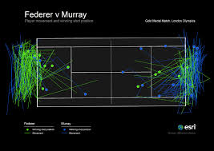

*** =right
<br/ >

<br/ >

--- bg:black

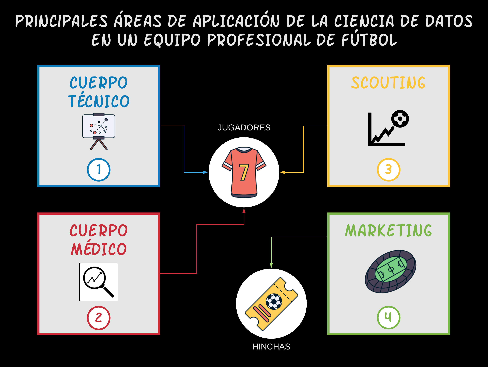
</a>

--- .segue bg:#0C7BB9
## Datos y herramientas

---
## Datos de eventos

> - Registro de distintos eventos relevantes con sus detalles respectivos

</a>

> - 
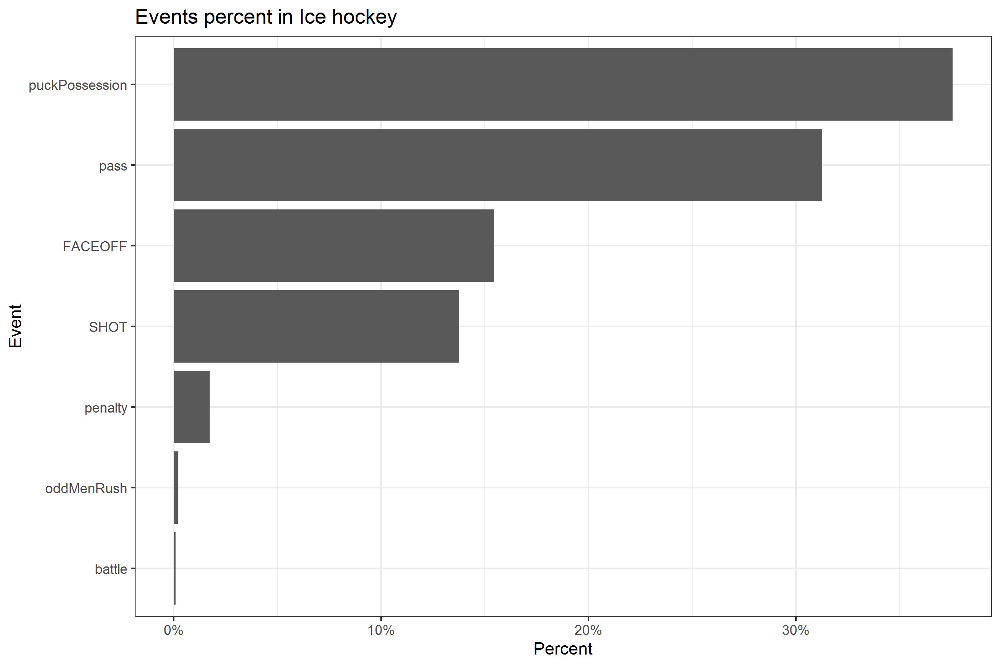
</a>

--- &twocol w1:50% w2:50%
## Proveedores

*** =left
<br/ >
<br/ >

<br/ >
<br/ >
<br/ >

*** =right

<br/ >
<br/ >

---
## Herramientas

--- .segue bg:#0C7BB9
## Ejemplos en fútbol y hockey sobre hielo

---
## 1) Modelos xG
<br/ >
> - xG: eXpected Goals (Goles esperados)

> - Se busca estimar la probabilidad de gol que tienen los tiros antes de ejecutarse

> - Es un problema de clasificación con dos salidas: "GOL" y "NO GOL"

> - Clases muy desbalanceadas: En fútbol aprox. el 11% de los tiros son goles (y en hockey el 6%)

---
## Características modelos xG

> - Variables más relevantes: distancia al arco y ángulo de tiro

> - [Modelo básico con regresión logística](https://www.thesignificantgame.com/portfolio/expected-goals-model-with-tidymodels/)
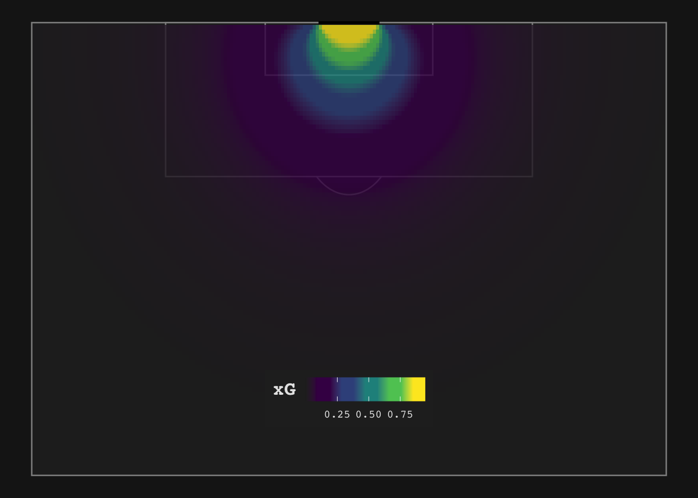

> - Otras variables: parte del cuerpo, posición del arquero, altura del balón, cantidad y posición de defensas, etc. [Acá un ejemplo con más variables y usando GBM](https://www.datofutbol.cl/xg-model/)

---
## Características modelos xG

Influencia de la cantidad de oponentes en la trayectoria del tiro:

--- &twocol w1:50% w2:50%
## Características modelos xG

*** =left
> - **AUC**

 

*** =right
> - [Calibración](https://dtai.cs.kuleuven.be/sports/blog/how-data-availability-affects-the-ability-to-learn-good-xg-models)

--- &twocol w1:50% w2:50%
## Aplicaciones modelos xG: Contexto + Scouting

*** =left
> - [Timeline + Shotmap](https://twitter.com/R_by_Ryo/status/1304854594950815744?s=20)

*** =right
> - [Shotmap de una temporada](https://twitter.com/StatifiedF/status/1250759002088144899)
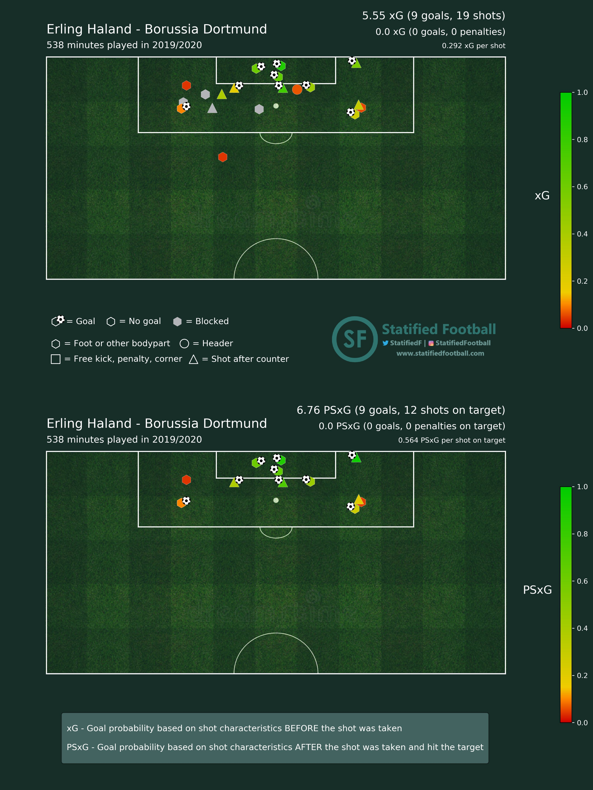

---
## Aplicaciones xG: Optimización de line-up

> - Pregunta: 쯈ué tipo de jugadores maximimizan la producción ofensiva?

> - Enfoque: Usar el xGF% (proporción de xG a favor respecto al xG total) como predictor de la
prob. de ganar -> con xGF 55% tienes 60% prob. de ganar<br/ >
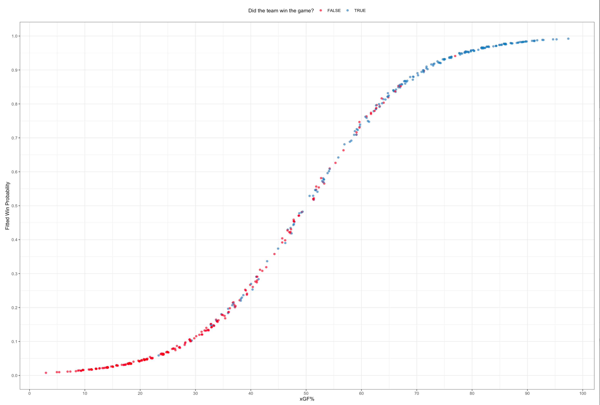

--- &twocol w1:50% w2:50%
## Aplicaciones modelos xG: Optimización de line-up

> - Método:<br/ > - Clustering de jugadores según estilo de juego y performance ofensiva<br/ >-Calcular xGF% para todos los tiros en Estados 5-5 de una temporada asociados a cada combinación de 3 delanteros (Forwards)

*** =left
> - Ranking de combinaciones de 3 delanteros según XGF%: mejores line-ups!<br/ ><br/ >
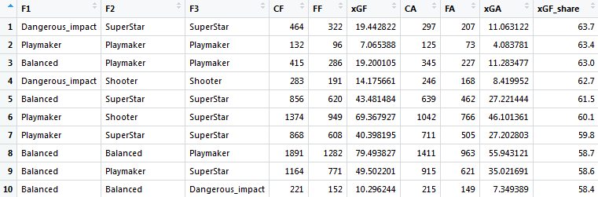
 

*** =right
> - Conformación de plantel<br/ >
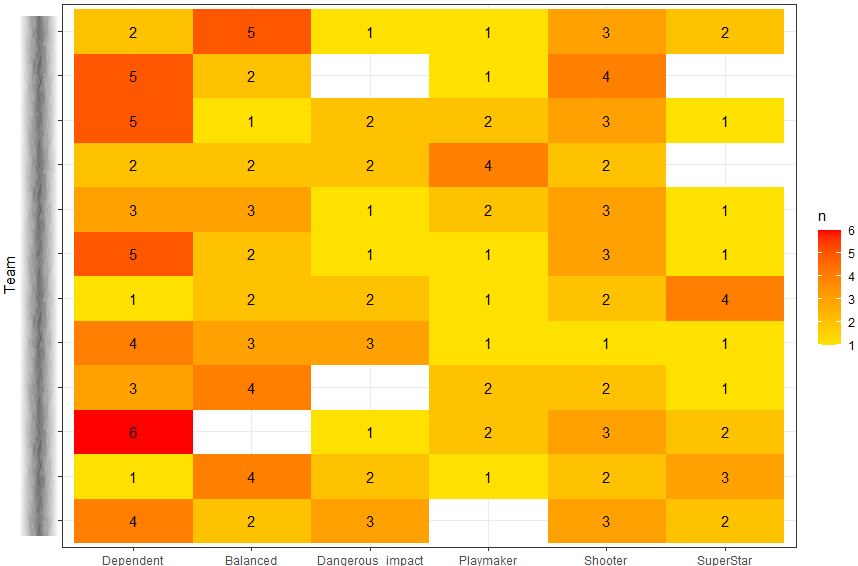

---
## Aplicaciones modelos xG

El xG es el proxy de generar/conceder peligro de gol. Es la base para otras métricas que buscan valorar pases y posesión: xA, xGchain, xGBuild, xT, VAEP, g+, etc.

<blockquote class="twitter-tweet" data-theme="dark">
Lukaku convertía el 3-3 con una gran asistencia de Hakimi. Pero vean la genialidad de <a href="https://twitter.com/Alexis_Sanchez?ref_src=twsrc%5Etfw">@Alexis_Sanchez</a> 😍<a href="https://t.co/NIMiD1llQf">pic.twitter.com/NIMiD1llQf</a>
&mdash; Inter Club México (@InterClubMX) <a href="https://twitter.com/InterClubMX/status/1309955924103172098?ref_src=twsrc%5Etfw">September 26, 2020</a></blockquote> 

---
## 2) Clustering de pases

> - Idea: observar patrones de ubicación, longitud, y dirección de pases, en específico asistencias en la zona ofensiva, tanto a nivel de jugadores como de equipo en situaciones particulares de un partido.

> - Problema: son muchos pases!<br/ >
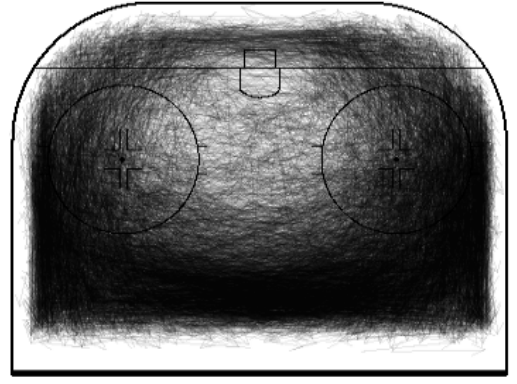

> - Enfoque: aplicar clustering para facilitar la visualización

--- &twocol w1:50% w2:50%
## Resultados del clustering

Luego de algunas iteraciones optamos por 39 clusters, aceptando errores en favor de mantener la simetría y la ubicación de tiros

*** =left

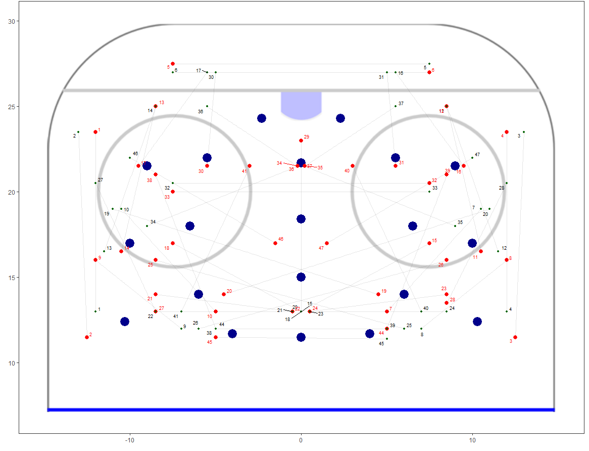

*** =right
> - 

<br/ >

--- &twocol w1:50% w2:50%
## Aplicación del clustering: nivel equipo

*** =left

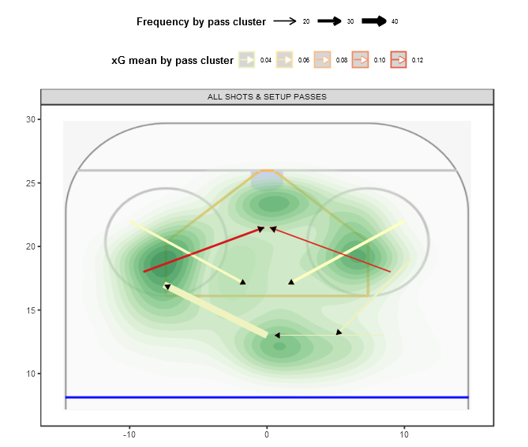

*** =right

---
## Aplicación del clustering: nivel jugador

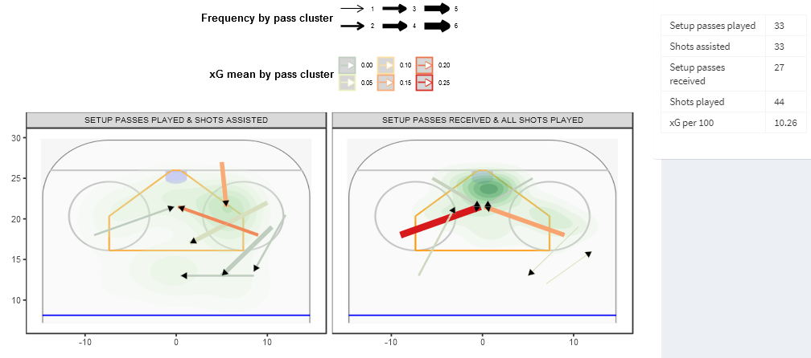

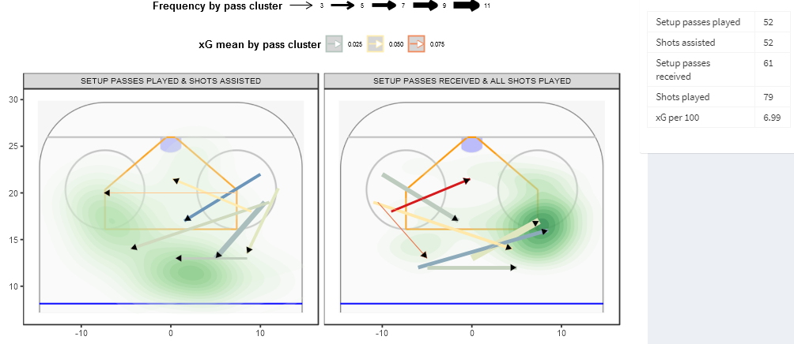

---
## 3) Similitud de jugadores
<br/ >
> - Idea: Un caso recurrente en scouting es buscar un reemplazo a un jugador que se va/fue o bien querer a alguien que tenga un perfil similar a un jugador específico.
<br/ >
<br/ >
> - Problema: Pueden ser decenas o cientos de candidatos + puede haber buenos candidatos que no están en mi radar + se requieren muchos recursos para analisar y evaluar a cada uno.
<br/ >
<br/ >
> - Enfoque: Crear un perfil cuantitativo del jugador de referencia en cuanto a performance (percentiles en atributos relevantes dentro de un universo objetivo) + aplicar un algoritmo/función de similitud + aplicar filtros según condiciones de borde para acotar la cantidad de candidatos

---

--- &twocol w1:30% w2:60%
## 4) Análisis espacio-temporal con tracking data
<br/ >
*** =left
1° versión del [paquete {SoccerAnimate}](https://github.com/Dato-Futbol/soccerAnimate)<br/ >

*** =right

</a>

--- &twocol w1:50% w2:50%
## Otras aplicaciones

*** =left
> - [Pitch control model + VAEP](https://twitter.com/TonyElHabr/status/1304766718468857857)<br/ >

</a>

*** =right
> - [Corners auto-tagging](https://twitter.com/EightyFivePoint/status/1301193951978848256)<br/ ><blockquote class="twitter-tweet">
The paper that <a href="https://twitter.com/suds_g?ref_src=twsrc%5Etfw">@suds_g</a> and I have written on corner routine analysis using tracking data is now available for download on the Machine Learning in Sports Analytics workshop website<a href="https://t.co/nnRBKsOH2U">https://t.co/nnRBKsOH2U</a>  Here&#39;s an example of our *automated tagging* of defensive roles at corners <a href="https://t.co/AnmyVz2NK3">pic.twitter.com/AnmyVz2NK3</a>
&mdash; Laurie Shaw (@EightyFivePoint) <a href="https://twitter.com/EightyFivePoint/status/1301193951978848256?ref_src=twsrc%5Etfw">September 2, 2020</a></blockquote> 

--- {tpl: thankyou, social: [{href: "https://futbolytics.cl"}, {title: Twitter, href: "https://twitter.com/DatoFutbol_cl"}, {title: Blog, href: "https://datofutbol.cl"}]}

## Gracias!

