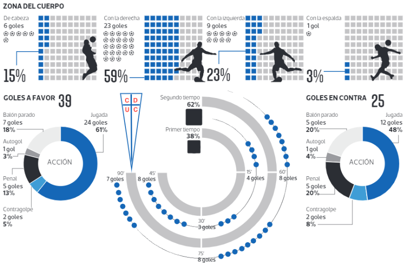
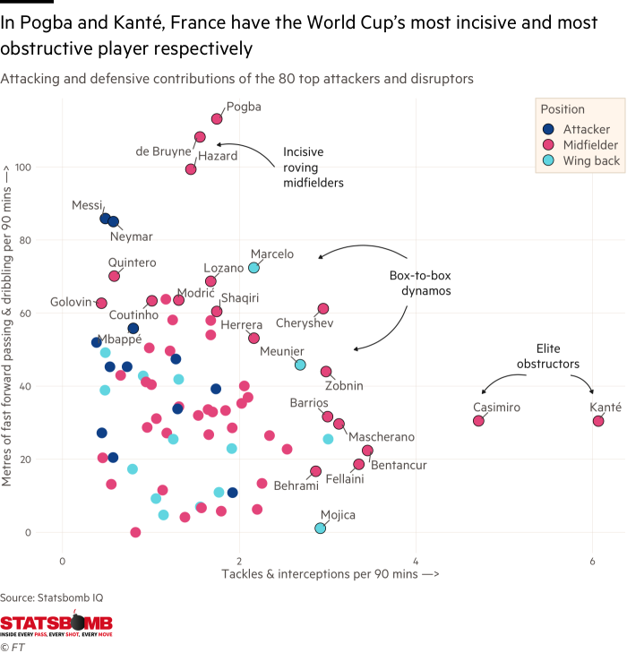

## ¿Qué haremos?
<br/ >
> - Una mirada al Soccer Analytics: Propuesta de categorías de análisis 
(Ejemplos + recursos + comunidad)
<br/ >
<br/ >
> - Usando R: [datofutbol.cl](datofutbol.cl) -> Paquetes y ejemplos
<br/ >
<br/ >
> - Otros ejemplos con R (y sin R también!)
<br/ >
<br/ >
> - Desafíos

--- bg:black

</a>

--- &twocol w1:50% w2:50%
*** =left
<br/ >
<br/ >
<br/ >

<br/ >
<br/ >
<br/ >

<br/ >
<br/ >
<br/ >

*** =right
<br/ >
<br/ >
<br/ >

<br/ >
<br/ >
<br/ >

<br/ >
<br/ >
<br/ >

--- 

</a>

--- bg:#cbd5e8 

</a>

--- bg:#cbd5e8
## (1) Estadísticas históricas

</a>

--- bg:#e6f5c9

</a>

--- bg:#e6f5c9
## (2) Modelos de probabilidades

</a>

--- bg:#fff2ae

</a>

--- bg:#fff2ae  
## (3) Performance de jugadores

</a>

--- bg:#f4cae4

</a>

--- bg:#f4cae4
## (4) Análisis espacial/temporal de eventos del juego

</a>

--- bg:black
<br/ >

</a>

--- bg:white
## Dato Fútbol

</a>

--- bg:white
## Flujo de Trabajo en Ciencia de Datos
<br/ >

</a>

--- bg:white
## Paquetes utilizados
<br/ >

</a>

--- .segue bg:#33a02c
## Ejemplos DatoFutbol.cl 

--- &twocol w1:50% w2:50% bg:#cbd5e8
*** =left
<br/ >
<br/ >
<br/ >

</a>

*** =right
<br/ >
<br/ >
<br/ >

</a>

--- &twocol w1:50% w2:50% bg:#cbd5e8
*** =left
<br/ >
<br/ >

</a>

*** =right
<br/ >
<br/ >
<br/ >

</a>

--- bg:#cbd5e8

<iframe src="https://bustami.shinyapps.io/ranking_fifa/" width="850" height="550" scrolling="yes" frameBorder="0"></iframe>

--- &twocol w1:50% w2:50% bg:#e6f5c9
*** =left
<br/ >
<br/ >
<br/ >

</a>

*** =right
<br/ >
<br/ >
<br/ >

</a>

--- &twocol w1:50% w2:50% bg:#e6f5c9
*** =left
<br/ >
<br/ >
<br/ >

</a>

*** =right
<br/ >
<br/ >
<br/ >

</a>

--- bg:#fff2ae
<br/ >
<br/ >

</a>

--- &twocol w1:50% w2:50% bg:#f4cae4
*** =left
<br/ >
<br/ >
<br/ >

</a>

*** =right
<br/ >
<br/ >
<br/ >

</a>

--- bg:#f4cae4
<br/ >
<br/ >

</a>

--- bg:#f4cae4
<br/ >

</a>

--- .segue bg:#3182bd
## Otros ejemplos (con R)

--- $vcenter
<br/ >
<br/ >

</a>

--- &vcenter

</a>

--- .segue bg:#636363
## Otros ejemplos (sin R)

--- &vcenter

</a>

</a>

--- &vcenter

</a>

--- &vcenter
<blockquote class="twitter-tweet" data-lang="es">
It&#39;s the most anticipated club match of the year, and it hasn&#39;t disappointed. This was the first goal, for Boca Juniors, a great counterattack with an amazing assist by Nández. <a href="https://twitter.com/hashtag/FinalLibertadores?src=hash&amp;ref_src=twsrc%5Etfw">#FinalLibertadores</a> <a href="https://twitter.com/hashtag/RiverBoca?src=hash&amp;ref_src=twsrc%5Etfw">#RiverBoca</a> <a href="https://t.co/Up2fH68E6c">pic.twitter.com/Up2fH68E6c</a>
&mdash; Last Row (@lastrowview) <a href="https://twitter.com/lastrowview/status/1071883167924142084?ref_src=twsrc%5Etfw">9 de diciembre de 2018</a></blockquote>

--- &vcenter
<blockquote class="twitter-tweet" data-lang="es">
Experimenting with new metrics using Voronoi diagrams: the number near the goal is the % of the relevant area &quot;owned&quot; by the attacking team. The number goes up from 15% to 30% with the key pass of the play. Useful to calculate goal contribution? <a href="https://t.co/3bbaNBG4bP">pic.twitter.com/3bbaNBG4bP</a>
&mdash; Last Row (@lastrowview) <a href="https://twitter.com/lastrowview/status/1068846306980970497?ref_src=twsrc%5Etfw">1 de diciembre de 2018</a></blockquote>

---
## Desafíos

> - Acceso a los datos

> - [Estandarización](http://www.analiticasports.com/por-que-la-fifa-hizo-una-alianza-con-barcelona-para-unificar-la-captura-y-procesamiento-de-datos-del-futbol/)

> - Ganarse el espacio: Evidenciar con más fuerza y claridad el valor agregado de los datos +
Romper antiguos esquemas dentro del fútbol

> - Hacer un meetup!

--- {
 tpl: thankyou,
 social: [{title: Twitter, href: "@ismaelgomezs / @DatoFutbol_cl"}]
}

## Gracias!

