

## ¿Qué veremos?
<br/ >
>- Breve contexto histórico
<br/ >
<br/ >
>- Categorías según tipos de datos:
<br/ >
<br/ >
    - Información que contienen
<br/ >
<br/ >
    - ¿Cómo conseguir los datos?
<br/ >
<br/ >
    - Objetivo o uso típico (ejemplos de aplicaciones)
<br/ >
<br/ >
>- Desafíos
<br/ >
<br/ >
>- ¿Cómo llega Chile a la Copa América?

--- 
### Charles Reep: Pionero en recolección de datos de fútbol

<br/ >
> - En la década del 50 inició un conteo riguroso de tiros, goles, pases, quites, etc. de partidos de la liga inglesa.
<br/ >
<br/ >
> - Algunos insights de su paper "Skill and Chance in Association Football" (Journal of the Royal Statistical Society, 1968) con 15 años de datos:<br/ ><br/ >
        - 1 gol cada 9 tiros<br/ >
        - Casi la mitad de los goles ocurrían cerca del área luego de una recuperación<br/ >

---

> - Pocos pases consecutivos<br/ ><br/ >

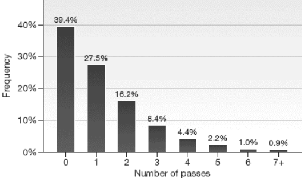<figcaption> "The Numbers Game - Anderson & Sally"       Note: Horizontal axis shows the number of successful passing moves, where 0 means that a pass attempt was immediately intercepted; 1 means one successful pass before possession lost and so on. Numbers atop bars indicate the percentage of moves in a match. Reep and Benjamin found only 8.5 per cent of passing movements contained more than three passes.</figcaption>
</a>
<br/ >
> - A partir de estos resultados reafirmó su visión de juego que solo buscaba la efectividad.

--- bg:black

<figcaption></figcaption>
</a>

--- bg:black
<br/ >
<br/ >
<br/ >

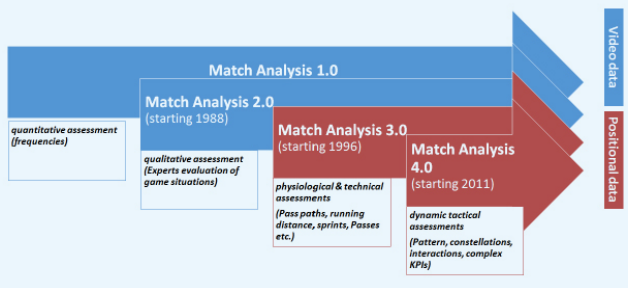
</a>

--- bg:black
<br/ >

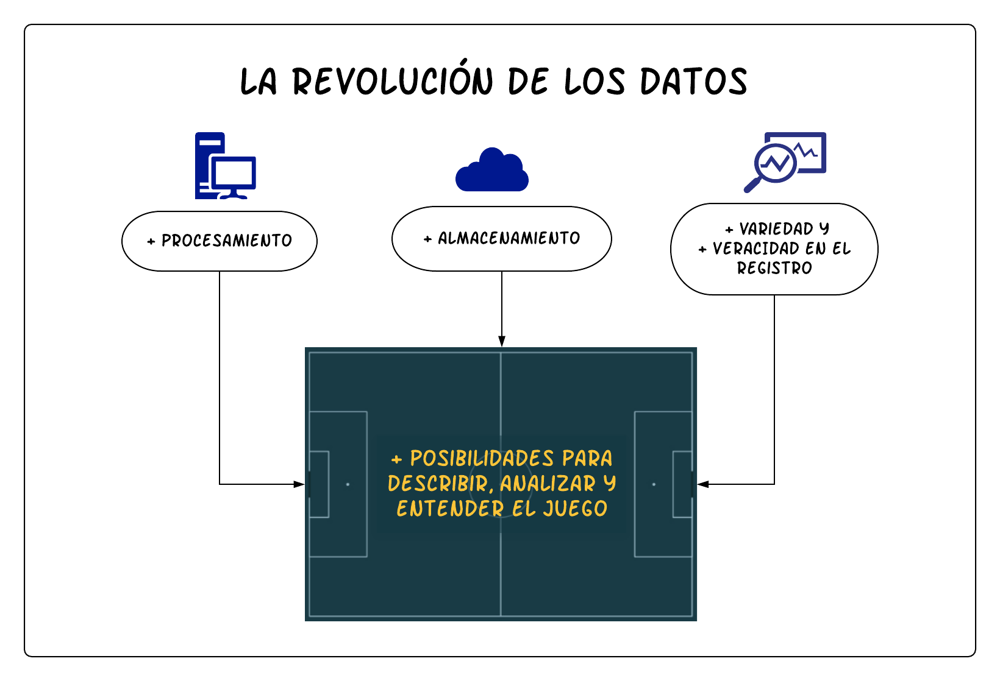

--- bg:black

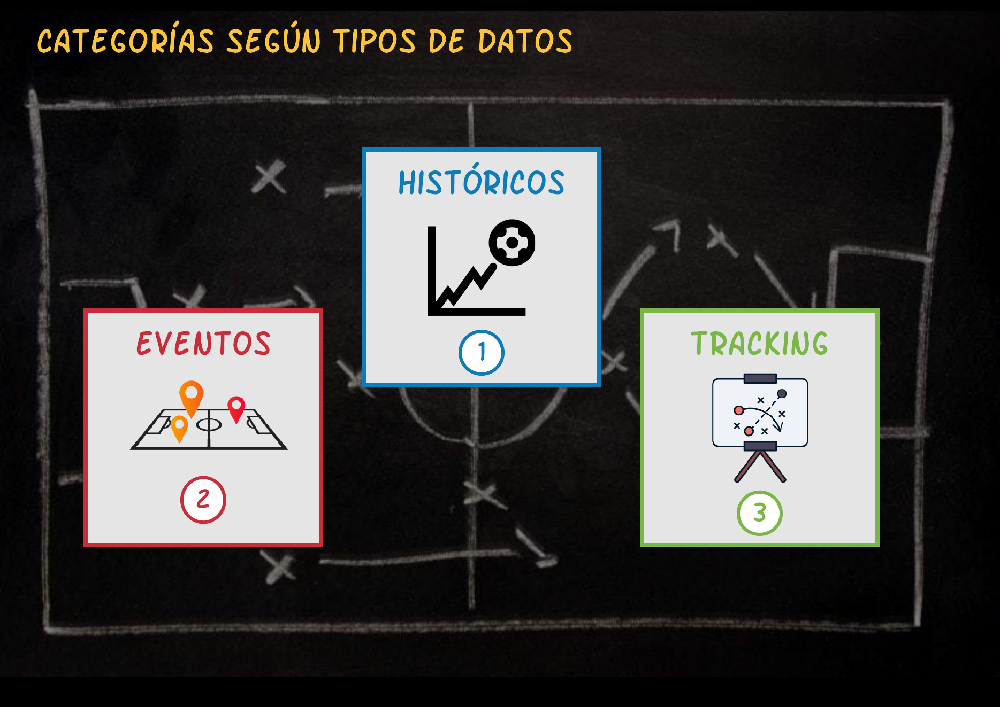
</a>

---
<left></left></a>

### Contiene:
>- Información general de partidos (Fecha, Estadio, Árbitro, Torneo, Equipos, Alineación, etc.)
<br/ >
<br/ >
>- Resultados (1T, 2T)
<br/ >
<br/ >
>- Cantidad y momento de incidencias (Goles, Tiros, Tarjetas, Corners, Penales, Off-sides, etc.)
<br/ >
<br/ >
>- Tablas de posiciones (Copas, PJ, PG, PE, PP, GF, GC, %R, etc.) y Rankings
<br/ >
<br/ >
>- Información de jugadores (Edad, Altura, Nacionalidad, Valor $ en el mercado, Minutos jugados, etc.)
<br/ >
<br/ >
>- Otros (Ej: Factores de pago de casas de apuestas, Habilidades de jugadores)

--- &twocol w1:50% w2:50%
## ¿Dónde se consiguen?
*** =left
<br/ >

<br/ >
<br/ >
<br/ >

<br/ >
<br/ >
<br/ >

<br/ >
<br/ >
<br/ >

*** =right

<br/ >
<br/ >
<br/ >

<br/ >
<br/ >
<br/ >

<br/ >
<br/ >
<br/ >

---
## Objetivo y/o Aplicaciones
<br/ >
> - Estadística descriptiva
<br/ >
<br/ >
> - Dar un contexto previo o descripción posterior a un partido o torneo
<br/ >
<br/ >
> - Infografías, comparaciones, rankings, récords, etc.
<br/ >
<br/ >
> - Modelos de probabilidades

--- .segue bg:#0C7BB9
## Ejemplos

--- &twocol w1:50% w2:50% 
*** =left
> - 
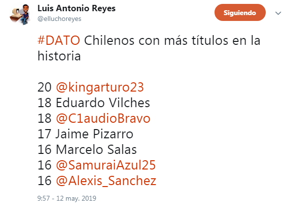
</a>
> - 
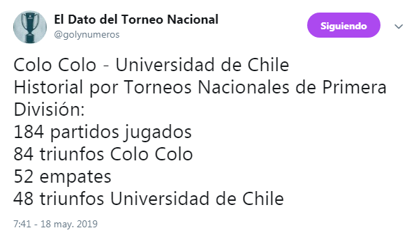
</a>

*** =right
> - 
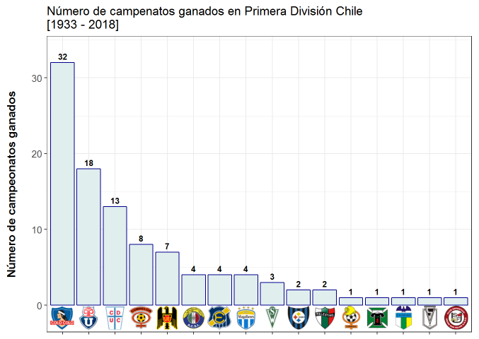
</a>
> - 
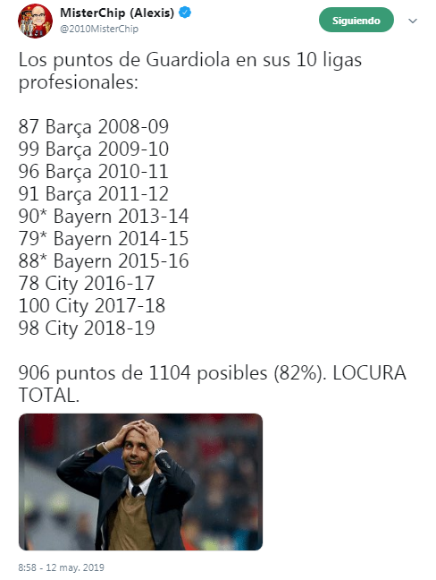
</a>

--- &twocol w1:50% w2:50% 
*** =left
> - 

</a>
> - 

</a>

*** =right
> - 

</a>
> - 
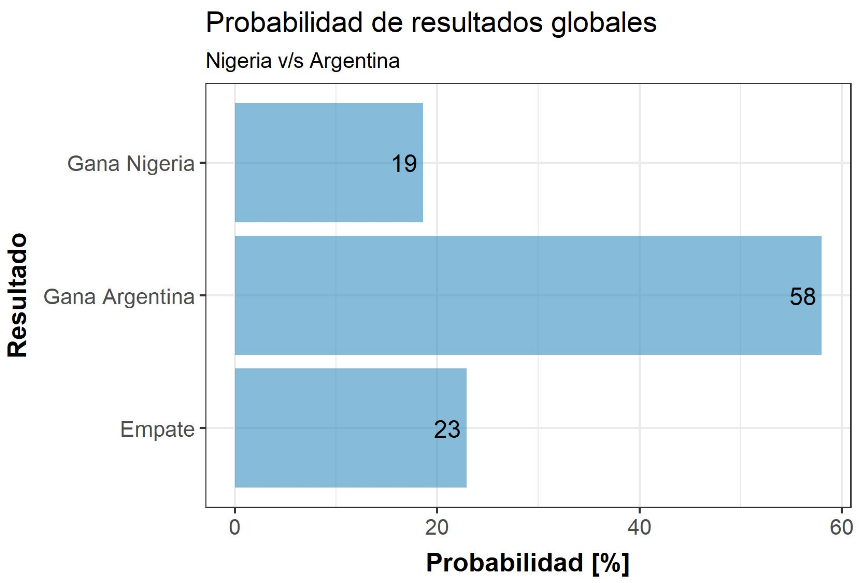
</a>

---

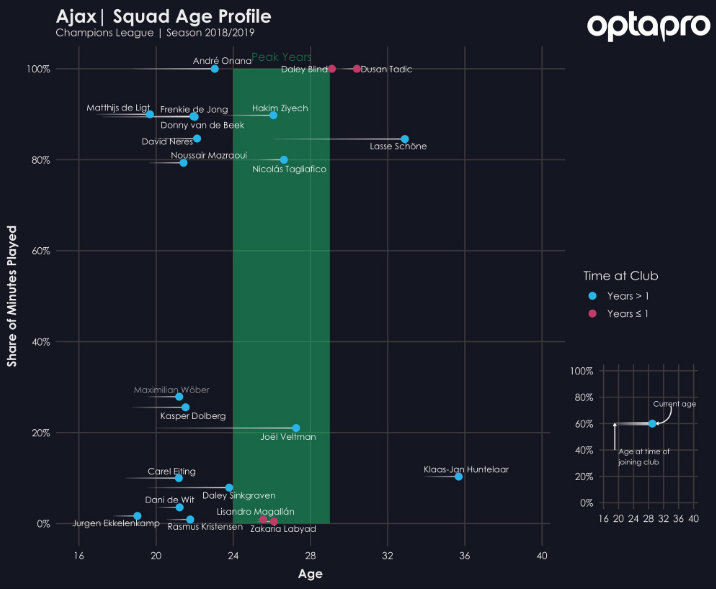
</a>

---
<left></left></a>

### Contiene:
>- Momento y `Ubicación` (x, y) de eventos (tiros, pases, quites, dribleos, presión defensiva, etc.)
<br/ >
<br/ >
>- Jugadores involucrados en los eventos
<br/ >
<br/ >
>- Detalles adicionales asociados (parte del cuerpo, N° de posesión, resultado del evento, altura, dimensiones de la cancha, etc.)
<br/ >
<br/ >
>- Métricas especializadas
<br/ >
<br/ >

--- &twocol w1:50% w2:50%
## ¿Dónde se consiguen?
*** =left
<br/ >

<br/ >
<br/ >
<br/ >

<br/ >
<br/ >
<br/ >

<br/ >

<br/ >

*** =right

<br/ >

<br/ >
<br/ >
<br/ >

<br/ >
<br/ >
<br/ >

---
## Objetivo y/o Aplicaciones
<br/ >
> - Análisis espacial y direccional de eventos (Shotmaps, Passing Networks, Heatmaps y Comparaciones espaciales de distintos eventos, etc.)
<br/ >
<br/ >
> - Performance grupal e individual (por partido y/o temporada, por posiciones, ponderado por minutos de juego, Radar plots, etc.)
<br/ >
<br/ >
> - Creación de métricas específicas (xG, xA, xChain, xBuildUp, xThreat, Pases por minuto de posesión, Longitud media de pases, Velocidad media de secuencias de pases, etc.)
<br/ >
<br/ >
> - Otros (Ej: Contextualizar temporal y espacialmente series de eventos, Descripción más profunda de partidos y estilos de juego)

--- .segue bg:#d7301f
## Ejemplos

--- 
## Expected Goals (xG)
<br/ >

</a>

--- 
## Shotmap

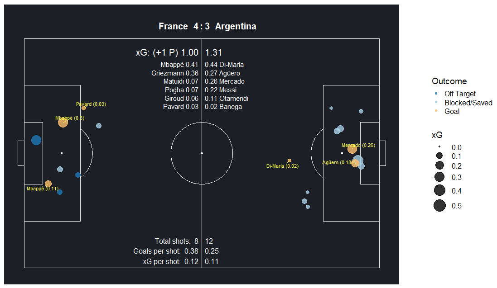
</a>

--- 
## xG Timeline

</a>

---
## Passing networks

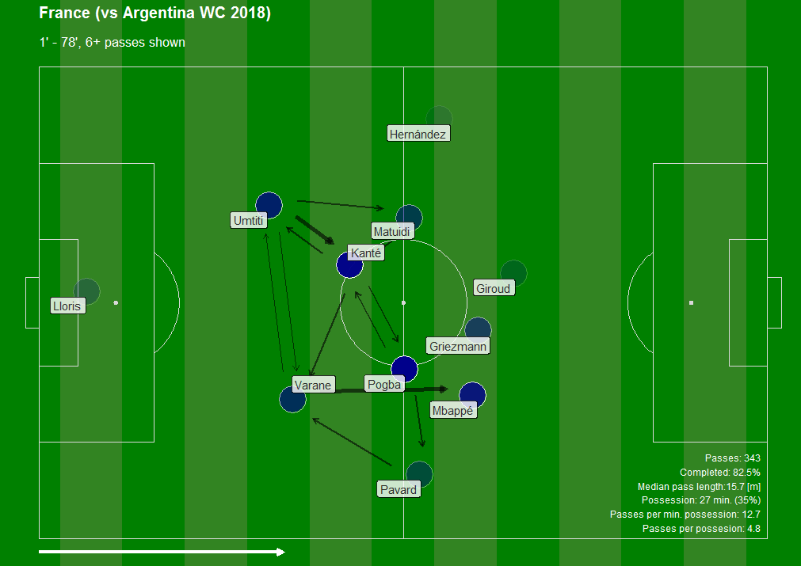
</a>

---
<br/ >

</a>

--- &twocol w1:50% w2:50%
# Event heatmaps & position maps
*** =left
> - 
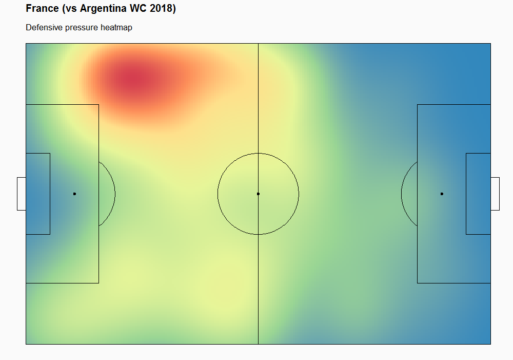
</a>
> - 

</a>

*** =right
> - 
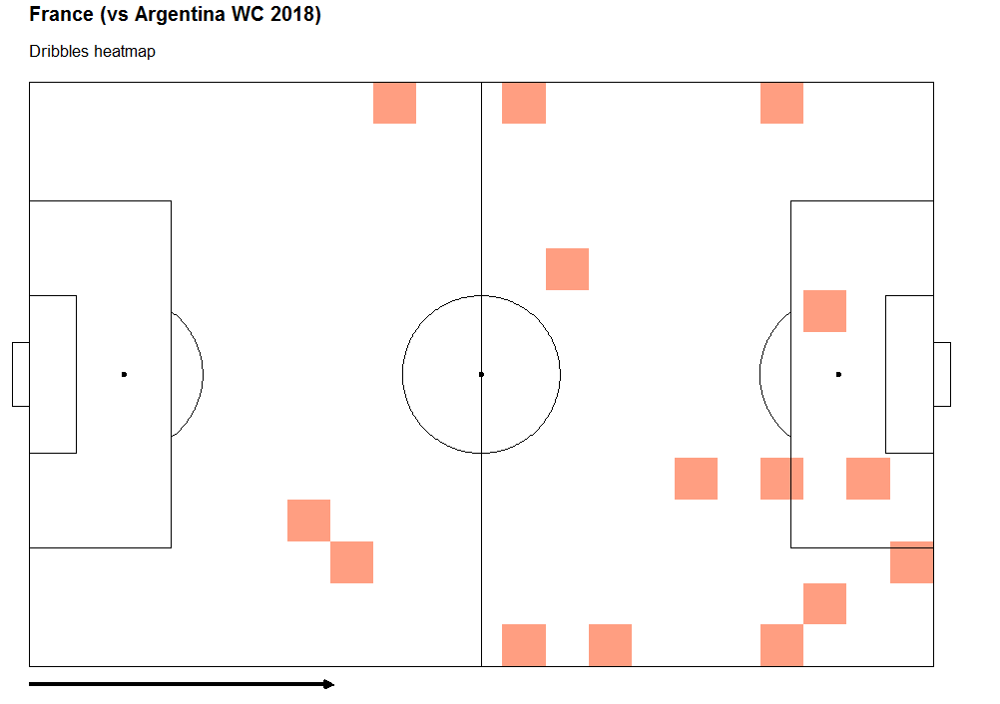
</a>
> - 
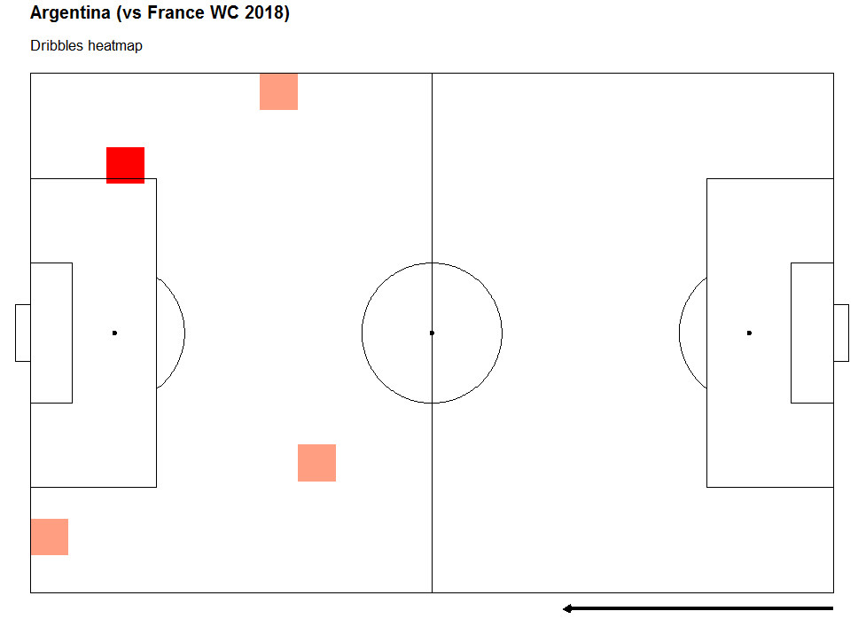
</a>

---
## Defensive coverage

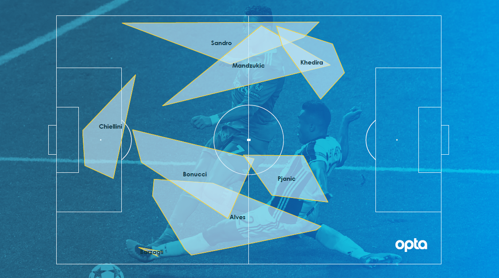
</a>

--- &twocol w1:50% w2:50%
# Positional analysis & comparison
*** =left
> - 
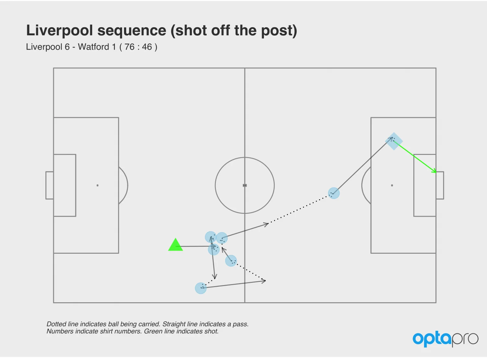
</a>
> - 

</a>
*** =right
> - 
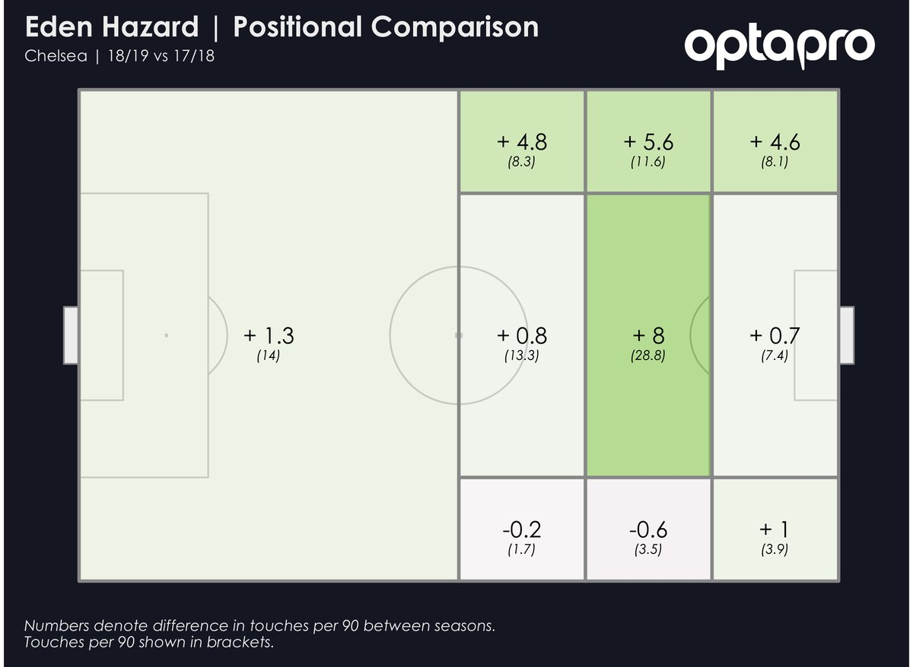
</a>
> - 
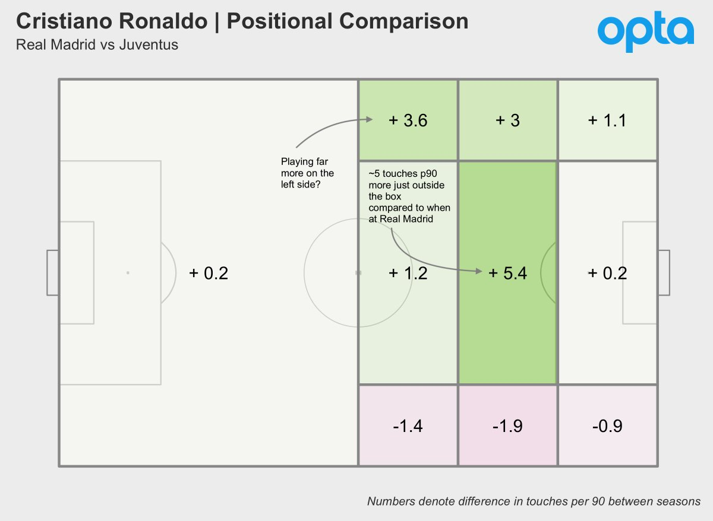
</a>

--- 
# Individual performance: xG + xA

</a>

---
# Individual performance: comparison + xGChain

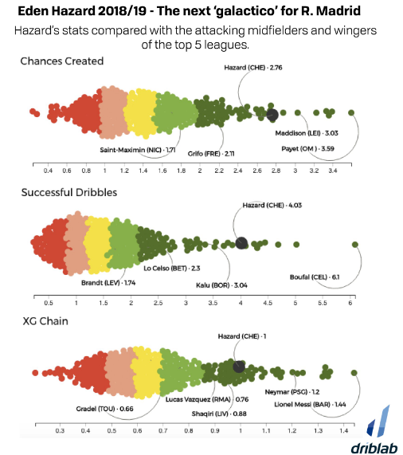
</a>

---
# Individual performance: p90 + radar plots
<br/ >

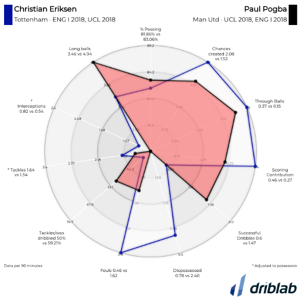
</a>

---
## xT
<iframe src="https://karun.in/blog/expected-threat.html" height="95%" width="95%" frameborder="0" allowfullscreen=""></iframe>

---
<left></left></a>

### Contiene:
>- Ubicación (x, y) de cada jugador y el balón a cierta frecuencia (Ej: 10 Hz)
<br/ >
<br/ >
>- Información complementaria (nombre y número de camiseta de jugadores, dimensiones de la cancha, equipos, tiempo de juego, etc.)

--- &twocol w1:50% w2:50%
## ¿Dónde se consiguen?
*** =left

<br/ >

<br/ >
<br/ >

<br/ >
<br/ >
<br/ >

*** =right

<br/ >
<br/ >

<br/ >

<br/ >

---
## Objetivo y/o Aplicaciones
<br/ >
> - Recrear jugadas (Revisión de jugadas claves y/o errores, dar indicaciones a jugadores, etc.)
<br/ >
<br/ >
> - Análisis espacio-temporal de ambos equipos (Convex-Hull, Voronoi, etc., Dominio espacial de un equipo sobre otro, Ganancia de área relevante)
<br/ >
<br/ >
> - Métricas de desempeño (Distancia recorrida, Velocidad, Heatmaps, etc.)
<br/ >
<br/ >
> - Uso en competencia y en entrenamiento (Cruce con datos fisiológicos: prevención de lesiones)
<br/ >
<br/ >
> - Otros (Ej: Análisis y valoración de juego sin balón)

--- .segue bg:#79B647
## Ejemplos

---
<br/ >
<br/ >
<iframe src="https://www.linkedin.com/embed/feed/update/urn:li:ugcPost:6537417704251420673?compact=1" height="100%" width="100%" frameborder="0" allowfullscreen=""></iframe>

---
<br/ >

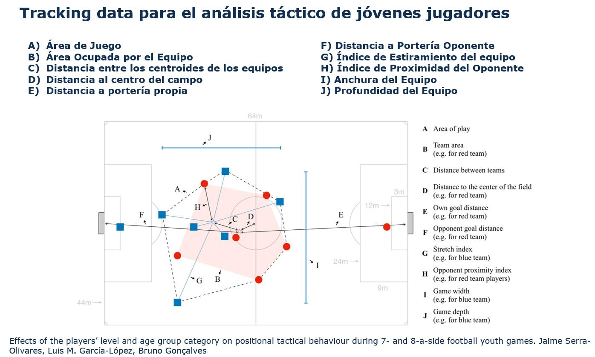

--- &vcenter
<blockquote class="twitter-tweet" data-conversation="none" data-lang="es">
New update of soccerAnimate function: + voronoi diagrams + method setting [convexhull, voronoi, clean]  Next step: calculate/show metrics each sample &amp; globally (areas+lenghts+%s)  Thanks to <a href="https://twitter.com/thomasp85?ref_src=twsrc%5Etfw">@thomasp85</a> for such a great packages <a href="https://twitter.com/hashtag/gganimate?src=hash&amp;ref_src=twsrc%5Etfw">#gganimate</a> <a href="https://twitter.com/hashtag/ggforce?src=hash&amp;ref_src=twsrc%5Etfw">#ggforce</a>  Code:<a href="https://t.co/xqah1jhZ82">https://t.co/xqah1jhZ82</a> <a href="https://t.co/jQW0LbxZuH">pic.twitter.com/jQW0LbxZuH</a>
&mdash; Dato Fútbol (@DatoFutbol_cl) <a href="https://twitter.com/DatoFutbol_cl/status/1136334821712699392?ref_src=twsrc%5Etfw">5 de junio de 2019</a></blockquote>

--- &vcenter
<blockquote class="twitter-tweet" data-lang="es">
Experimenting with new metrics using Voronoi diagrams: the number near the goal is the % of the relevant area &quot;owned&quot; by the attacking team. The number goes up from 15% to 30% with the key pass of the play. Useful to calculate goal contribution? <a href="https://t.co/3bbaNBG4bP">pic.twitter.com/3bbaNBG4bP</a>
&mdash; Last Row (@lastrowview) <a href="https://twitter.com/lastrowview/status/1068846306980970497?ref_src=twsrc%5Etfw">1 de diciembre de 2018</a></blockquote>

--- bg:white
## Flujo de trabajo típico

</a>

--- bg:white
## Flujo de trabajo típico

</a>

---
## Desafíos
> - 1) Que todo el medio se actualice en el tema: Cuerpos técnicos + Dirigentes + Periodismo deportivo + Analistas + Academia + Hinchas. Equipos y Selección, a nivel formativo y adulto, masculino y femenino.
<br/ >
<br/ >
> - 2) Acceso a los datos: 
    - Conocimiento + Difusión -> Interés + Confianza -> Financiamiento. 
    - Proyectos de democratización (Ej: Superliga Argentina, La Liga España, Statsbomb)
<br/ >
<br/ >

> - 3) Estandarización en el registro ([Fifa validation](http://www.analiticasports.com/por-que-la-fifa-hizo-una-alianza-con-barcelona-para-unificar-la-captura-y-procesamiento-de-datos-del-futbol/)) y en el cálculo de métricas.
<br/ >
<br/ >
> - 4) Trabajo interdisciplinario entre Cuerpo Técnico, Equipo Médico y Analistas.

---
## ¿Cómo llega Chile a la Copa América?
<br/ >
> - Análisis exploratorio y comparativo del desempeño de las selecciones que jugarán la Copa
<br/ >
<br/ >
> - Considerando datos de los partidos amistosos del último año (posterior al mundial de Rusia)
<br/ >
<br/ >
> - Datos de Wyscout (prueba gratuita de 14 días) [Categorías 1 y 2]. 

---
<br/ >
<iframe src="https://bustami.shinyapps.io/copa-america-2019/" height="100%" scrolling="yes" frameBorder="0"></iframe>
Data source: Wyscout; Data viz: Dato Fútbol

---
# Análisis ofensivo
En comparación a sus rivales de la Copa, Chile en sus últimos partidos:

> - Ha generado hartas ocasiones de gol (tiene el 2do `xG_p90 más alto`), pero no concreta (tiene el peor valor de la razón `Goals_p90 / xG_p90`).
<br/ >
> - Ha realizado varios tiros (`shot_p90` mayor al promedio y con el más alto `xG_per_shot`) pero con una `on target accuracy` de las más bajas (35%). Es decir, no le achunta al arco.

> - 
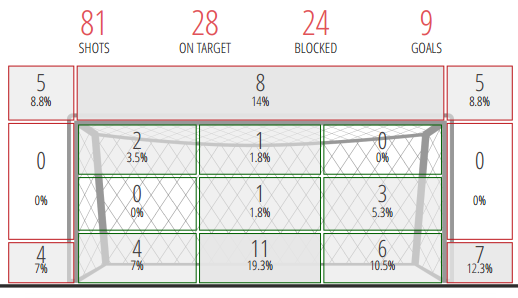
</a>

---
Incluso considerando que patea desde cerca.
<br/ >

</a>

---
# Análisis defensivo
En comparación a sus rivales de la Copa, Chile en sus últimos partidos:
<br/ >
> - Su `posesión` está sobre el promedio, pero es el segundo equipo que `recibe más goles` por cada 90 minutos.
<br/ >
<br/ >
> - Sus rivales tienen una cantidad mayor al promedio de `contraataques que terminan con tiros al arco`.
<br/ >
<br/ >
> - Está dentro de los 7 equipos que realiza mayor `pressing`, pero de esos es el 2do al cual más le generan `tiros` y goles. A pesar de que "está bien" en cuanto a recuperaciones, intercepciones, duelos defensivos, cruces, duelos aéreos, pérdidas de balón, etc. Se podría mejorar en `recuperaciones en el mediocampo`.

--- {
 tpl: thankyou,
 social: [{ href: "https://twitter.com/DatoFutbol_cl"}]
}

## Gracias!

